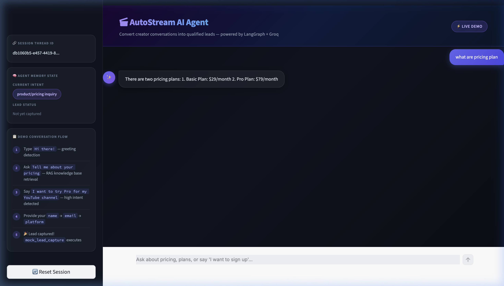

<div align="center">


# 🎬 AutoStream AI Agent
### *Social-to-Lead Agentic Workflow*

**Convert creator conversations into qualified leads — automatically.**

[](https://python.org)
[](https://langchain-ai.github.io/langgraph/)
[](https://groq.com)
[](https://fastapi.tiangolo.com)
[](https://streamlit.io)
[](./LICENSE)

</div>

---

## 📸 Live Demo Preview

> The agent intelligently routes user intent, retrieves pricing from its knowledge base, and progressively collects lead data — name → email → platform — before executing the lead capture tool.



---

## 🧠 What Is This?

**AutoStream AI Agent** is a production-grade, **stateful conversational AI** built for ServiceHive's assignment. It simulates a real-world B2B SaaS sales agent for **AutoStream** — a fictional automated video editing platform.

The agent handles multi-turn conversations via a **LangGraph state machine**, classifying every message into one of three intents and routing it through the appropriate workflow node — all while remembering context across 5–6 turns using `MemorySaver`.

---

## ✨ Key Features

| Feature | Details |
|---|---|
| 🧩 **Intent Classification** | 3-way: greeting / pricing inquiry / high-intent lead |
| 📚 **RAG Knowledge Base** | Local FAISS + HuggingFace embeddings (no paid API) |
| 🔁 **Stateful Memory** | LangGraph `MemorySaver` + `thread_id` per session |
| 🛡️ **Strict Tool Guard** | `mock_lead_capture()` only fires when ALL 3 fields are present |
| ⚡ **Groq LLM** | `llama-3.3-70b-versatile` — blazing fast inference |
| 🎨 **Premium UI** | Dark glassmorphism Streamlit SaaS interface |
| 🔌 **REST API** | FastAPI `POST /chat` with session-aware memory |

---

## 🏗️ Architecture

```
┌─────────────────────────────────────────────────────────────────┐
│                      Streamlit Chat UI                           │
│           (thread_id generated per browser session)             │
└─────────────────────────┬───────────────────────────────────────┘
                          │ POST /chat  {thread_id, message}
                          ▼
┌─────────────────────────────────────────────────────────────────┐
│                    FastAPI Backend (:8000)                        │
│                    app/main.py                                   │
└─────────────────────────┬───────────────────────────────────────┘
                          │ invoke(state, config)
                          ▼
┌─────────────────────────────────────────────────────────────────┐
│                   LangGraph State Machine                         │
│                                                                  │
│   START                                                          │
│     │                                                            │
│     ▼                                                            │
│  [process_message] ──── classify_intent() ─────────────────┐    │
│         │                extract_lead_info()                │    │
│         ▼                                                   │    │
│   ┌─────┴──────┬────────────────┐                          │    │
│   │            │                │                          │    │
│   ▼            ▼                ▼                          │    │
│ [greeting] [rag_answer]  [lead_routing] ◄──────────────────┘    │
│             │                   │                                │
│         FAISS RAG          ┌────┴─────┐                         │
│         KB lookup          │  Missing │                         │
│                            │  Fields? │                         │
│                            └────┬─────┘                         │
│                     ┌──────────┬┴──────────┐                    │
│                     ▼          ▼            ▼                    │
│               [collect_name] [collect_email] [collect_platform]  │
│                                                                  │
│                        all fields present?                       │
│                               │                                  │
│                               ▼                                  │
│                    [execute_mock_tool] ← STRICT GUARD            │
│                     mock_lead_capture(name, email, platform)     │
│                               │                                  │
│                              END                                 │
└─────────────────────────────────────────────────────────────────┘
          Persistence: MemorySaver (thread_id keyed checkpoints)
```

---

## 📁 Project Structure

```
autostream-agent/
│
├── 📂 app/                          # LangGraph backend
│   ├── state.py                     # GraphState TypedDict definition
│   ├── intents.py                   # LLM intent classifier (structured output)
│   ├── rag.py                       # FAISS + HuggingFace RAG chain
│   ├── tools.py                     # mock_lead_capture() tool
│   ├── graph.py                     # LangGraph nodes, edges, MemorySaver
│   └── main.py                      # FastAPI POST /chat endpoint
│
├── 📂 frontend/
│   └── streamlit_app.py             # Premium dark SaaS chat UI
│
├── 📂 assets/
│   └── demo.png                     # UI screenshot
│
├── knowledge_base.md                # RAG source documents (plans + policies)
├── requirements.txt                 # All dependencies
├── .gitignore                       # Excludes .env, __pycache__, venvs
└── README.md                        # This file
```

---

## 🧰 Tech Stack

| Layer | Technology | Purpose |
|---|---|---|
| **LLM** | Groq `llama-3.3-70b-versatile` | Intent classification, lead extraction, RAG answers |
| **Agent Framework** | LangGraph | Stateful multi-turn graph with conditional routing |
| **Embeddings** | `sentence-transformers/all-MiniLM-L6-v2` | Free local HuggingFace embeddings |
| **Vector Store** | FAISS (CPU) | Local knowledge base retrieval |
| **Backend** | FastAPI + Uvicorn | REST API, thread-keyed session management |
| **Frontend** | Streamlit | Conversational SaaS UI |
| **Memory** | LangGraph `MemorySaver` | Checkpointed state per `thread_id` |
| **Config** | `python-dotenv` | Secure `.env` API key loading |

---

## 📚 Knowledge Base (RAG Source)

```markdown
Basic Plan       → $29/month · 10 videos/month · 720p resolution
Pro Plan         → $79/month · Unlimited videos · 4K resolution · AI captions
Policies         → No refunds after 7 days · 24/7 support on Pro only
```

---

## 🔄 Conversation Flow (Demo)

Follow this exact sequence to test all agent capabilities:

```
Step 1 — Greeting Detection
  You:  "Hi there!"
  Bot:  👋 Welcome to AutoStream! Here's how I can help...

Step 2 — RAG Pricing Retrieval
  You:  "What are your pricing plans?"
  Bot:  📦 Basic ($29/mo) · Pro ($79/mo) + AI captions...

Step 3 — High-Intent Lead Detected
  You:  "I want to sign up for Pro for my YouTube channel"
  Bot:  🎉 Awesome! What's your name?

Step 4 — Name Collected (MemorySaver persists it)
  You:  "Tejas Rajput"
  Bot:  Great, Tejas! What's your email address?

Step 5 — Email Collected
  You:  "tejas@autostream.ai"
  Bot:  ✅ Lead captured! mock_lead_capture() fires → lead_captured = True

Step 6 — Guard Activates
  You:  (any follow-up)
  Bot:  We've already saved your details! Is there anything else?
```

> ⚡ **Note:** The `mock_lead_capture()` tool fires **only once**, only when **all 3 fields** (name + email + platform) are confirmed in the LangGraph state.

---

## 🚀 Local Setup

### 1. Clone the Repository

```bash
git clone https://github.com/tejashvi-singh/AutoStream-AI-Agent.git
cd AutoStream-AI-Agent
```

### 2. Install Dependencies

```bash
pip3 install -r requirements.txt
```

### 3. Configure API Key

Create a `.env` file in the project root:

```bash
echo "GROQ_API_KEY=your_groq_api_key_here" > .env
```

Get your free Groq API key at → [console.groq.com](https://console.groq.com)

### 4. Start the Backend

```bash
# Terminal 1 — Kill stale process and start FastAPI
lsof -ti:8000 | xargs kill -9 2>/dev/null
python3 -m uvicorn app.main:fastapi_app --reload --port 8000
```

### 5. Start the Frontend

```bash
# Terminal 2 — Kill stale process and start Streamlit
lsof -ti:8501 | xargs kill -9 2>/dev/null
python3 -m streamlit run frontend/streamlit_app.py --server.port=8501
```

### 6. Open the App

```
http://localhost:8501
```

---

## 🔌 WhatsApp Webhook Integration (Approach)

This agent can be extended to a WhatsApp Business API lead bot in 3 steps:

| Step | Implementation |
|---|---|
| **1. Webhook Endpoint** | Add `POST /webhook` to FastAPI to consume Meta's payload and respond to `hub.challenge` handshakes |
| **2. Thread ID Mapping** | Use the user's WhatsApp phone number as the LangGraph `thread_id` to persist state across distributed messages |
| **3. Response Delivery** | Replace HTTP JSON response with async POST to Meta's Graph API (`https://graph.facebook.com/v18.0/{phone_id}/messages`) to push replies back to WhatsApp |

---

## 🧩 Why LangGraph?

> LangGraph was chosen over vanilla LangChain or a plain ReAct agent because the lead capture workflow requires **strict, ordered state transitions** — not free-form tool calling.

| Problem | LangGraph Solution |
|---|---|
| Tool fires too early (before all fields collected) | Conditional edges with hard guards in `route_lead_capture()` |
| State lost between API calls | `MemorySaver` checkpoints entire `GraphState` per `thread_id` |
| Complex branching logic | Named nodes + explicit edges replace ambiguous prompt chaining |
| Deterministic flow required | Graph structure prevents LLM from skipping steps |

---

## ⚙️ State Schema

```python
class GraphState(TypedDict):
    messages:         list[AnyMessage]   # Full conversation history (append-only)
    intent:           str | None         # Last classified intent
    name:             str | None         # Lead's name
    email:            str | None         # Lead's email
    creator_platform: str | None         # YouTube / TikTok / Instagram...
    lead_captured:    bool               # Safety flag — prevents double tool fire
```

---

## 📡 API Reference

### `POST /chat`

```json
// Request
{
  "thread_id": "uuid-string",
  "message": "I want to try the Pro plan"
}

// Response
{
  "response": "🎉 Awesome choice! What's your name?",
  "intent": "high-intent lead",
  "lead_captured": false
}
```

---

## 📦 Dependencies

```
langgraph               # Stateful agent graph
langchain               # Core chain abstractions
langchain-groq          # Groq LLM integration
langchain-community     # FAISS, TextLoader
langchain-huggingface   # HuggingFace embeddings
fastapi                 # REST API server
uvicorn                 # ASGI server
streamlit               # Chat UI
python-dotenv           # .env loading
faiss-cpu               # Local vector database
sentence-transformers   # Free local embeddings
pydantic                # Data validation
```

---

## 👨‍💻 Author

**Tejas Rajput**
Built for *ServiceHive* AI Engineering Assignment

[](https://github.com/tejashvi-singh)

---

<div align="center">

**⭐ Star this repo if you found it useful!**

*Built with LangGraph · Groq · FastAPI · Streamlit*

</div>
